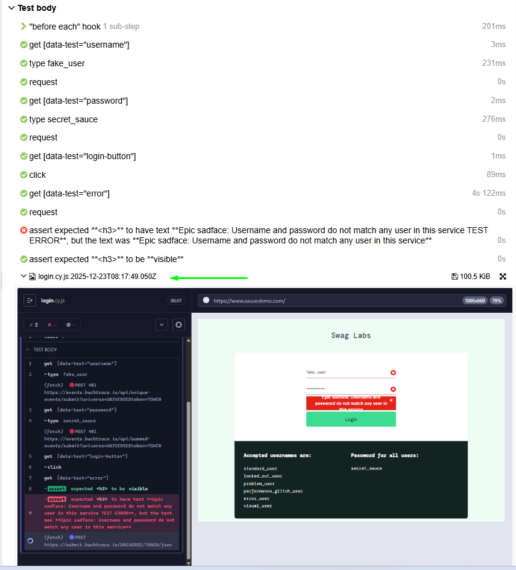

# Educabot - Challenge QA

Este repositorio contiene las respuestas y recursos del **Challenge QA de Educabot**.  
El objetivo es demostrar habilidades en **automatización de pruebas con Cypress**, manejo de **reportes (Allure)** y buenas prácticas de **QA manual y automatizado**.

## Comenzando

Antes de comenzar, tener instalado:

- [Node.js](https://nodejs.org/) (versión 16 o superior)
- [npm](https://www.npmjs.com/)
- [Java](https://www.oracle.com/java/technologies/javase-downloads.html) (versión 11 o superior, requerido por Allure report)

### Requisitos

Clonar el repositorio
```bash
git clone https://github.com/CristianDavidChinoBejar/Educabot_ChallengeQA.git
cd Educabot_ChallengeQA
code .
```

### Instalación

Instalar las dependencias

```bash
npm install 
```

### Navegación con Cypress Test Runner

Una vez instaladas las dependencias, se puede ejecutar el proyecto desde el Cypress Test Runner con el siguiente comando:
```bash
npm run cypress:open
```
El proyecto ya está listo para ejecutar los test E2E y en Google Chrome, solo tenes que seleccionar la suite que queres ejecutar.

### Ejecución en modo headless con reportes de Allure report
Ejecutar los siguientes comandos en el siguiente orden:

```bash
npm run test:e2e
```
Esto ejecutará los test en modo headless. A continuación ejecutar:
```bash
npm run report:generate
```
```bash
npm run report:open
```
Este último comando abrira automaticamente el reporte de Allure report.

### 📊 Importante
Las evidencias de los test fallidos se deberan desplegar desde el reporte generado, Allure report no los muestra desplegados automaticamente por un tema de armonia visual de los test.


